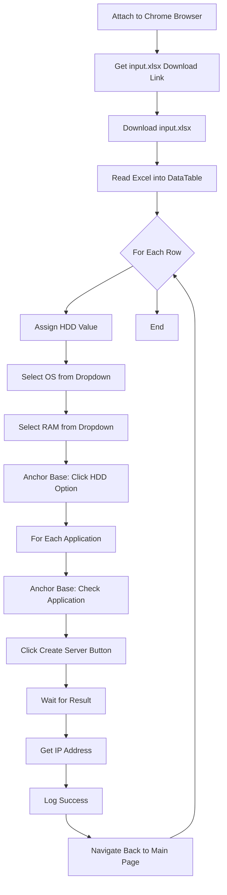

# Setup Server Automation

A UiPath automation project that reads server configuration requests from an Excel file and automatically provisions virtual servers via the [BotsDNA Server Setup Portal](https://botsdna.com/server/).

## Overview

This bot automates the end-to-end process of creating servers on the BotsDNA platform. It downloads the input file from the web portal, reads each request row, fills out the server configuration form (OS, RAM, HDD, Applications), submits the request, and captures the assigned IP address for each successfully created server.

## Features

- **Web Data Extraction** — Automatically detects and downloads the latest `input.xlsx` from the portal
- **Excel-Driven Processing** — Reads all server requests from a structured Excel file
- **Dynamic Form Filling** — Selects OS, RAM, HDD, and Applications based on input data
- **Anchor-Based UI Automation** — Uses Anchor Base activities to reliably locate dynamic form elements
- **Error Handling** — Try-Catch blocks ensure failed requests are logged without stopping the entire batch
- **Result Capture** — Extracts and logs the assigned IP address for each successfully created server
- **Batch Navigation** — Automatically returns to the main page after each request to process the next row

## Prerequisites

- **UiPath Studio** 2024.10+ (Modern Design Experience)
- **Google Chrome** browser
- **UiPath.Excel.Activities** package
- **UiPath.UIAutomation.Activities** package
- **UiPath.WebAPI.Activities** package

## Input File Format (`input.xlsx`)

The Excel file must contain a sheet named `Sheet1` with the following columns:

| Column | Description | Example Values |
|--------|-------------|----------------|
| **RequestID** | Unique identifier for the request | `REQ-001`, `REQ-002` |
| **OS** | Operating System to install | `WINDOWS 10`, `Windows Server 2019`, `WINDOWS 7` |
| **RAM** | RAM configuration | `8 GB`, `16 GB`, `32 GB`, `64 GB` |
| **HDD** | Hard disk option | `500 GB`, `1 TB`, `2 TB` |
| **Applications** | Comma-separated list of apps to install | `Chrome,Firefox,Notepad++` |

### Supported OS Values
- WINDOWS NT, WINDOWS 7, WINDOWS 8, WINDOWS 10
- Windows Server 2019, Windows Server 2016
- Windows Server 2012 R2, Windows Server 2012
- Windows Server 2008 R2, WINDOWS CE

### Supported RAM Values
- 8 GB, 16 GB, 32 GB, 64 GB

## Workflow Steps

## Key Technical Details

### Dynamic Selectors
The workflow uses **dynamic selectors** with `string.Format()` to locate elements based on variable values:

- **HDD Selection**: `<<webctrl tag='TABLE' /><webctrl tag='LABEL' innertext='{0}' />` (where `{0}` = `strHDD`)
- **Application Checkboxes**: `<<webctrl tag='TABLE' /><webctrl tag='LABEL' aaname='{0}' tableRow='4' />` (where `{0}` = `app_name`)

### Anchor Base Strategy
- **Anchor**: `WaitUiElementAppear` / `Find Element` locates the label by text
- **Action**: `Click` or `Check` performs the action on the nearby input element
- **AnchorPosition**: `Auto` (UiPath automatically determines relative position)

### Lazy-Loaded Dropdown Handling
The RAM dropdown uses a **Click + Delay + SelectItem** pattern to handle lazy-loaded options:
1. Click the dropdown to expand it
2. Wait 1 second for items to populate
3. Select the target item

### Error Handling
Each row is wrapped in a **TryCatch** block:
- **Try**: Processes the server creation
- **Catch**: Logs an error message including the `RequestID`
- **Finally**: Empty (reserved for cleanup if needed)

## Variables

| Variable | Type | Scope | Purpose |
|----------|------|-------|---------|
| `server_URL` | String | Main | Base URL of the portal (`https://botsdna.com/server/`) |
| `strEndpoint` | String | Main | Download endpoint for input.xlsx |
| `dtInput` | DataTable | Main | Holds all requests from Excel |
| `strHDD` | String | Main | Current row's HDD value |
| `app_name` | String | Main | Current application being checked |
| `strIP_address` | String | Try | Extracted IP address after server creation |
| `row` | DataRow | ForEachRow | Current Excel row iterator |
| `currentText` | String | ForEach | Current application from comma-separated list |

## Setup Instructions

1. **Clone or download** this project to your UiPath Studio workspace
2. **Open** `setupserver.xaml` in UiPath Studio
3. **Ensure Google Chrome** is installed and the UiPath Chrome extension is enabled
4. **Navigate to** `https://botsdna.com/server/` in Chrome before running the bot
5. **Run** the automation from Studio or publish to Orchestrator

## Notes & Troubleshooting

| Issue | Solution |
|-------|----------|
| `Select Item` not found | The dropdown may be lazy-loaded. The workflow already includes a Click + Delay workaround. |
| `Anchor Base` timeout | The HDD label text may not match exactly. Verify the text in UiExplorer and update the selector if needed. |
| Browser not attaching | Ensure Chrome is open and the URL matches `*//botsdna.com/server/*`. Check the UiPath Chrome extension. |
| Excel file not found | The bot downloads `input.xlsx` automatically. Ensure the portal link is accessible. |

## Project Info

- **Framework**: Windows
- **Studio Version**: 2026.10+
- **Language**: Visual Basic
- **Project Type**: Process

## License

This project is for educational and demonstration purposes as part of the BotsDNA automation challenge.

---

*Built with UiPath Studio*
